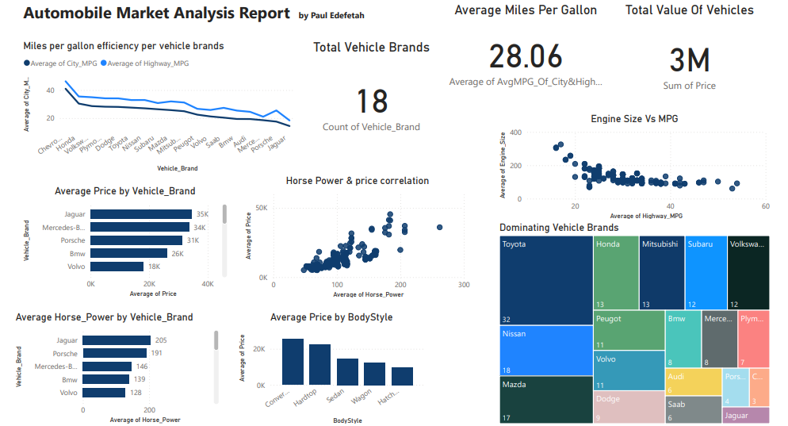

# Automobile Performance Dashboard

Interactive Power BI dashboard analyzing 205 vehicles across 22 brands to uncover what actually drives price, performance, and fuel efficiency in the automotive market.


## Overview

Every car tells a story — not just through speed or design, but through data. This project turns a raw, messy automotive dataset into a two-page, interactive Power BI report that lets decision-makers quickly spot trends, pricing drivers, and performance gaps across brands.

The report answers three questions:

1. Which brands lead the market on performance and presence?
2. How does price vary across manufacturers and body styles?
3. What actually drives vehicle price — efficiency, horsepower, engine size, or brand?

## Data source

[`data/Automobile_data.csv`](data/Automobile_data.csv) — 205 rows, 26 attributes per vehicle (make, body style, drive wheels, engine specs, MPG, price, etc.), based on the classic 1985 Ward's Automotive Yearbook automobile dataset.

The raw data arrived messy: missing values were encoded as `?` rather than blank, spread across several fields —

| Column | Missing values |
|---|---|
| `normalized-losses` | 41 of 205 |
| `price` | 4 |
| `bore` | 4 |
| `stroke` | 4 |
| `num-of-doors` | 2 |
| `horsepower` | 2 |
| `peak-rpm` | 2 |

Cleaning and handling these gaps in Power Query — without silently dropping rows the dashboard would need — was step one before any modeling could start.

## Data modeling

Rather than reporting directly off the flat CSV, the data was restructured into a star schema: one fact table (`Automobile`) plus five dimension tables (`Dim_Vehicle_Brand`, `Dim_BodyStyle`, `Dim_Drive_Wheels`, `Dim_Fuel_Type`, `Dim_Price_Band`). Fields were renamed to business-friendly labels and a derived field (average city+highway MPG) was added for the KPI cards.

Full breakdown of the model, field renames, and every visual's fields: [`docs/data-model.md`](docs/data-model.md).

## Screenshots



## What's in the report

**Page 1 — Overview**
- Average price and horsepower by brand (bar charts)
- Average price by body style
- Horsepower vs. price, and engine size vs. highway MPG (scatter plots, to check correlation)
- City/highway MPG trend by brand (line chart)
- KPI cards: total value of vehicles, average MPG, total brands
- Treemap of dominant brands by body-style count

**Page 2 — Engine detail**
- Average horsepower by number of cylinders

## Key insights

- Brand and body style materially move price — some manufacturers command a consistent premium independent of raw spec.
- Horsepower and price are positively correlated, but not linearly — efficiency and brand positioning explain a meaningful share of the spread.
- Fuel efficiency (city/highway MPG) varies more by brand than by any single engine spec, suggesting design philosophy matters as much as engineering.

## Skills demonstrated

- Data cleaning & transformation (Power Query, handling non-standard nulls)
- Dimensional data modeling (star schema, renamed/derived fields)
- DAX for aggregate measures and KPI cards
- Interactive report design: filters, KPIs, correlation visuals, treemap
- Turning a raw dataset into a decision-ready, narrative dashboard

## Repo structure

```
automobile-performance-dashboard/
├── data/
│   └── Automobile_data.csv          # source dataset
├── dashboard/
│   └── Automobile Dashboard Visualization.pbix   # Power BI report
├── docs/
│   └── data-model.md                # star schema, field mapping, visual-by-visual breakdown
└── README.md
```

## Reproducing this

1. Install [Power BI Desktop](https://www.microsoft.com/en-us/power-platform/products/power-bi/desktop) (free, Windows only).
2. Open `dashboard/Automobile Dashboard Visualization.pbix`.
3. The data source points at `data/Automobile_data.csv` — if you relocate the file, update the source path in Power Query (Transform Data → Data Source Settings).

## Attribution

Dataset originally sourced from the 1985 Ward's Automotive Yearbook, widely distributed as the "Automobile" dataset (e.g. via the UCI Machine Learning Repository). Used here for portfolio/educational purposes.

---

Originally shared on [LinkedIn](https://www.linkedin.com/feed/update/urn:li:activity:7394843996956766209/) by Paul Edefetah.
